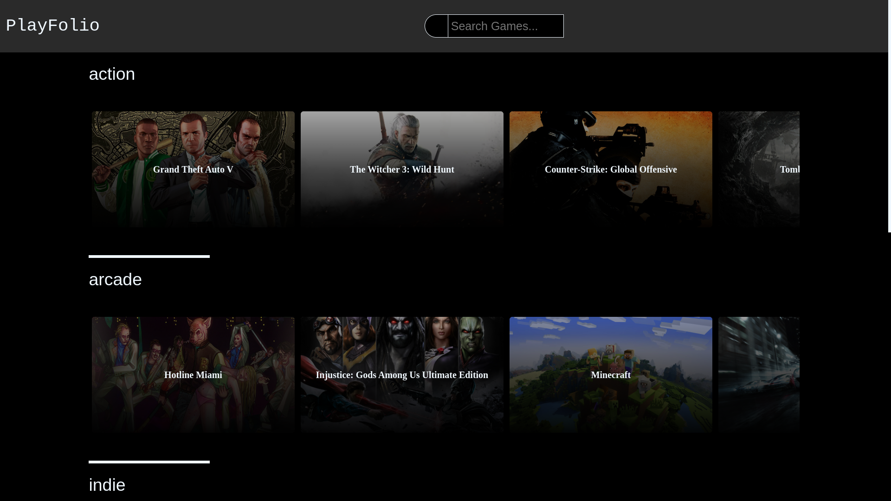

# PlayFolio

PlayFolio is a web application built with Angular that allows users to explore a wide range of games using the RAWG API. Users can search for games, view game details, and discover new titles. This README will guide you through setting up and using PlayFolio.

## Live Demo

Check out the live demo of PlayFolio: [PlayFolio Live Demo](https://playfolio.onrender.com/)

## Features

- Search for games using keywords.
- View detailed information about each game, including description, release date, and ratings.
- Explore a vast collection of games from the RAWG API.
